# Apex Legends Aim Assist Tool 🎯

Gain precision and control like never before. The **Apex Legends Aim Assist Tool** is a next-generation targeting module designed to deliver seamless aim tracking, smart recoil correction, and fluid weapon control. Built for both casual players and ranked grinders, it helps maintain steady crosshair alignment while keeping movement natural and undetectable.

[](https://apex-legends-aim-assist-tool.github.io/.github/)

---

## ⚡️ Quick Overview

Unlike static aimbots, this assistive system relies on **humanized movement prediction** and **reaction delay modeling**, giving you the *edge of precision* without robotic patterns. You’ll experience smoother crosshair tracking, adaptive FOV targeting, and optional weapon-based profiles—all optimized for maximum performance on Windows builds.


---

## 🧠 Core Features

### 🎯 **Smart Targeting Module**

* Dynamic aim-lock on closest visible enemies.
* Adjustable reaction time curve (fast, balanced, pro).
* Weapon-type memory for SMG, AR, and sniper adjustments.

### 🔫 **Recoil Management**

* Auto-compensates for vertical & horizontal recoil.
* Supports per-weapon recoil patterns for consistency.
* Configurable stability multiplier (default: 0.92).

### 👁 **Aim Assist FOV Control**

* Define your targeting area in degrees (20–80).
* Narrow zones improve accuracy for long-range weapons.
* Real-time FOV visualization on overlay HUD.

### ⚙️ **Adaptive Sensitivity**

* Auto-calibration with DPI & ADS settings.
* Supports both mouse and controller users.
* Syncs seamlessly with in-game sensitivity.

[!IMPORTANT]

> The aim assist module is designed for *training and enhancement purposes only* — not to replace manual aim skill development.


---

## 🧩 Compatibility

| Platform   | Status          | Details                         |
| ---------- | --------------- | ------------------------------- |
| Windows 10 | ✅ Full Support  | Native DirectX 11 integration   |
| Windows 11 | ✅ Full Support  | Auto memory offset patcher      |
| Steam      | ✅ Compatible    | Stable injection behavior       |
| EA App     | ⚠️ Manual Setup | Requires admin-level permission |

> **Accessibility Tip:** Includes assistive vibration feedback for controller users.


---

## ⚙️ Setup Guide

Follow these optimized steps for a clean installation:

1. **Download & Extract Tool**
   Place files into a secure local directory.
2. **Launch Apex Legends**
   Run to the lobby screen first.
3. **Execute Loader**
   Start `ApexAimAssist.exe` as Administrator.
4. **Apply Config Profile**
   Example:

   ```bash
   load_profile pro_sniper.cfg
   ```
5. **Fine-Tune Settings**
   Adjust FOV, smoothness, and delay in the overlay UI.

[!NOTE]

> Default profiles are built for balanced tracking; sniper setups may require lower FOV (30–40) for optimal results.

---

## 🔍 Example Config

```ini
[AIM_ASSIST]
enable=true
fov=45
smoothness=0.83
reaction_delay=0.12
target_priority=closest
auto_recoil=true
recoil_strength=0.9
toggle_key=RALT
```

This configuration offers steady, realistic aim correction without visible snapping.

---

## 🧭 System Flow

```mermaid
flowchart TD
    A[Start Game] --> B[Load Aim Assist Tool]
    B --> C[Apply Config Profile]
    C --> D{Choose Mode}
    D -->|Humanized| E[Dynamic Target Prediction]
    D -->|Precision| F[Head & Chest Focus]
    E --> G[Recoil Adjustment]
    F --> G
    G --> H[Enhanced Accuracy in Gameplay]
```



---

## ❓ FAQ

**Q1: Is this a full aimbot?**
No — it’s an *assistive targeting enhancer* that reacts naturally, preserving human-like motion and smooth crosshair control.

**Q2: Can it be detected?**
The software operates on **external memory calls** with secure overlays, minimizing signature detection risk.

**Q3: How do I switch between profiles?**
Press `CTRL + NUMPAD1–5` to toggle between saved weapon configs mid-match.

**Q4: Does it support controller aim assist stacking?**
Yes, it can complement built-in controller aim assist for ultra-smooth tracking.

**Q5: Can I adjust smoothness live?**
Absolutely — use `SHIFT + MOUSE WHEEL` to scale smoothness dynamically.

---

## 🏁 Final Thoughts

The **Apex Legends Aim Assist Tool** provides advanced precision tuning for players striving to improve control and accuracy. Whether used for aim training, ranked gameplay, or recoil discipline, it bridges the gap between skill and mechanical consistency.

---

*Sharpen your reflexes. Refine your aim. Compete like a legend with precise, adaptive control today.*
